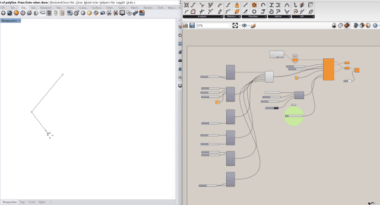

<p align="center">
  
</p>

<h1 align="center">Mycelium</h1>

<p align="center">
  Generative urban massing for <a href="https://www.grasshopper3d.com/">Grasshopper</a> (Rhino 8).<br/>
  Subdivide a parcel into blocks and streets, grow building typologies, allocate parks and trees, and generate terrain.
</p>

<p align="center">
  <a href="https://github.com/MyceliumGH-Dev/Mycelium/actions/workflows/ci-build.yml"></a>
  <a href="https://rhinopackages.github.io/?search=Mycelium"></a>
  <a href="https://yak.rhino3d.com/packages/Mycelium" target="_blank"></a>
  <a href="LICENSE"></a>
  
  <a href="https://doi.org/10.5281/zenodo.21764053"></a>
</p>

---

[](docs/images/mycelium-demo.mp4)

<p align="center">
  <a href="docs/images/mycelium-demo.mp4"><strong>▶ Watch the Mycelium workflow demo</strong></a>
</p>

## What it does

Mycelium takes a closed parcel boundary curve and generates complete urban massing alternatives:

1. **Subdivision** — recursive binary space partitioning splits the parcel into building blocks separated by streets.
2. **Typologies** — each block receives a randomly selected building type from the configurations you allow: courtyard (perimeter block), linear bar, point block, L-shape, U-shape, or tall tower.
3. **Open space** — a chosen number of blocks become parks, populated with procedural trees; courtyards can receive trees too.
4. **Metrics & reproduceability** — development metrics, environmental morphology indicators, and a versioned JSON case manifest for every generated alternative.

Every output is driven by a random seed, so alternatives are fully reproducible.

## Installation

### Via the Package Manager (recommended)

1. Click _Install in Rhino_ [here](https://rhinopackages.github.io/?search=mycelium&p=Mycelium).
3. Restart Rhino.

Components appear in Grasshopper under the **Mycelium** tab.

### Manual

Download `Mycelium.gha` from the [latest release](https://github.com/MyceliumGH-Dev/Mycelium/releases), unblock it, and place it in your Grasshopper libraries folder (`_GrasshopperFolders` > Components).

## Components

| Component | Tab / Panel | Purpose |
|---|---|---|
| **Massing Generator** | Mycelium / Massing | Main generator: parcel in, city block out |
| **Courtyard Config** | Mycelium / Building Types | Allow perimeter blocks with central courtyards |
| **Linear Config** | Mycelium / Building Types | Allow bar buildings along the block's long axis |
| **Point Config** | Mycelium / Building Types | Allow compact point blocks |
| **L-Shape Config** | Mycelium / Building Types | Allow L-shaped buildings |
| **U-Shape Config** | Mycelium / Building Types | Allow U-shaped buildings |
| **Tall Building Config** | Mycelium / Building Types | Allow towers |
| **Tree Config** | Mycelium / Vegetation | Tree density, size, and courtyard placement |
| **Green Network Generator** | Mycelium / Vegetation | Seeded perimeter belts, corridors, refuge patches, and schematic trees |
| **Terrain Generator** | Mycelium / Site | Procedural terrain from OpenSimplex noise ([docs](docs/terrain-generator.md)) |
| **Mycelium Templates** | Mycelium / Utilities | Browse and insert example definitions synced from [Mycelium-Templates](https://github.com/MyceliumGH-Dev/Mycelium-Templates) |

<details>
<summary><b>Massing Generator inputs &amp; outputs</b></summary>

**Inputs**: Boundary (closed planar curve), FloorHeight, Divisions (subdivision depth), StreetWidth, BuildingConfigs (from the config components), NumParks, GenerateFloorSlabs, Trees (from Tree Config), Seed, and an optional horizontal AnalysisDirection used by directional frontal-area metrics.

Right-click the Massing Generator and use **Street Network** to select `Irregular Grid`, `Orthogonal Grid`, `Diagonal Grid`, or `Radial–Concentric Grid`. The choice is stored in the Grasshopper definition and displayed beneath the component. `Irregular Grid` includes the original seeded `Recursive Orthogonal`, a seeded `Deformed Grid` with displaced shared intersections, and a `Staggered Grid` with offset rows and T-junctions. `Orthogonal Grid` includes nested `Regular Grid`, `Rectangular Grid`, `Cerdà Grid`, and `Hierarchical Superblock` options. Cerdà blocks have chamfered corners; the superblock option groups a fine 3×3 local grid within a wider primary-street grid. `Diagonal Grid` includes `Single Axis`, intersecting `Cross Axes`, and an `Orthogonal Overlay` that cuts a wider diagonal boulevard through a regular grid. `Radial–Concentric Grid` includes a full circular `Civic Core`, straight-sided `Polygonal Radial` rings, and a one-sided `Fan Plan`; all three terminate at a finite focal block instead of a point.

**Outputs**: Footprints, Masses, Heights, Streets, FloorSlabs, Parks, Courtyards, Trees, Parcels, Metrics, MorphologyMetrics, and CaseManifest.

`MorphologyMetrics` reports plan area density (`lambda_p`), open-space and park ratios, directional gross frontal area density (`lambda_f`), and building-height statistics including mean, standard deviation, median, and 90th percentile. `CaseManifest` is schema-versioned JSON containing a deterministic SHA-256 case ID, the effective generation parameters, random seed, plug-in version, street-network selection, model units, geometry counts, development metrics, and morphology metrics. Its schema is published at [`docs/case-manifest.schema.json`](docs/case-manifest.schema.json).

Each Building Type Config component exposes: floor range, corner radius, minimum footprint area, setback range, and building depth range. Feed any combination of configs into the generator — each block picks one at random.

</details>

The Green Network Generator is designed to follow the Massing Generator in the Grasshopper graph: connect the same site `Boundary`, connect `Footprints` to `BuildingFootprints`, and connect `Parks` to `ExistingParks`. Existing parks become anchors, new seeded refuges supplement them, and automatic corridors connect the combined network while excluding building footprints. Optional `CorridorGuides` override the automatic connectors when a designed route is required.

## Quick start

Drop a **Mycelium Templates** component on the canvas and click **Select Template** — it lists every template from the [Mycelium-Templates](https://github.com/MyceliumGH-Dev/Mycelium-Templates) repository, synced from the branch matching this plugin's version (downloaded and cached on first use). Click one to insert a working example graph next to the component.


## Staying up to date

Mycelium asks the Yak package registry once a day whether a newer version is published, and surfaces it in two places: a dismissible notice on the first Grasshopper canvas of a session, and an amber badge on the **Mycelium Templates** component (click it to open the Rhino Package Manager). The notice offers *Skip This Version* and *Never Remind Me Again*; both are remembered in `%AppData%/Mycelium/update-check.json` (delete that file to re-enable reminders). Right-click the templates component for **Check for Mycelium Updates Now**, which bypasses the daily throttle and any opt-out.

Offers follow the channel you are on: a stable install is never nudged towards a pre-release, while a `-beta` install is offered whichever is newer, the next beta or the stable that supersedes it. Every part of the check fails silently — being offline never blocks Grasshopper or shows an error.

## Development

<details>
<summary><b>Building from source</b></summary>

Requires the [.NET SDK](https://dotnet.microsoft.com/download) (8.0 or newer).

```bash
git clone https://github.com/MyceliumGH-Dev/Mycelium.git
cd Mycelium
dotnet build Mycelium.sln -c Release
# → src/Mycelium/bin/Release/net7.0/Mycelium.gha
```

The project targets plain `net7.0` and builds on Windows, macOS, and Linux. It is deliberately **not** `net7.0-windows`: that TFM binds the Windows Desktop framework, which has no macOS runtime pack, so the `.gha` silently fails to load in Rhino for Mac. Grasshopper's API still hands components WinForms types, so `System.Windows.Forms` is referenced compile-time-only from the .NET Framework 4.8 reference assemblies — the identity Rhino satisfies on both platforms. The Grasshopper NuGet package likewise ships .NET Framework reference assemblies and Rhino supplies the real ones at run time, so the NU1701 restore warning is suppressed intentionally.

</details>

<details>
<summary><b>Local development loop (.ghlink)</b></summary>

Every build writes a `Mycelium.ghlink` file into Grasshopper's Libraries folder pointing at the build output, so Grasshopper loads the freshly built `.gha` on the next Rhino start — no copying, no packaging:

| Platform | ghlink location |
|---|---|
| Windows | `%APPDATA%\Grasshopper\Libraries\Mycelium.ghlink` |
| macOS | `~/Library/Application Support/McNeel/Rhinoceros/8.0/Plug-ins/Grasshopper (b45a29b1-4343-4035-989e-044e8580d9cf)/Libraries/Mycelium.ghlink` |

Set `-p:MyceliumSkipGhLink=true` to suppress it (CI does not need it).

**Uninstall the released Mycelium package while developing.** If a Yak package is installed, Grasshopper loads that folder too, the released assembly usually wins on identity, and the canvas quietly shows the *released* components while you are editing the local ones. Rhino restarts are required for either to be picked up — Grasshopper caches its library scan for the session.

</details>

<details>
<summary><b>Creating a Yak package locally</b></summary>

```bash
scripts/package.sh
```

This builds the solution, assembles `dist/`, and produces the `.yak` package using the yak CLI from a local Rhino 8 installation. The package version comes from the root `manifest.yml`. CI runs the same staging logic (see below) as a dry-run on every push and PR to `dev`.

</details>

<details>
<summary><b>Releasing to the Package Manager</b></summary>

Publishing is fully automated through branch-triggered workflows (requires the `YAK_TOKEN_PATRICK` repository secret):

| Branch push | Workflow | Result on the Yak server |
|---|---|---|
| `pre-release` | *Yak Pre-Release* | `X.Y.Z-beta.W` (visible with "include pre-releases") |
| `release` | *Yak Release* | `X.Y.Z.W` (public) |

1. Bump `version:` in `manifest.yml` (4-part `X.Y.Z.W`) and update `CHANGELOG.md` on `dev`.
2. **Create the matching branch in [Mycelium-Templates](https://github.com/MyceliumGH-Dev/Mycelium-Templates)** (`git push origin main:X.Y.Z.W` there) — the Templates component syncs from the branch named after the plugin version.
3. Merge / fast-forward `dev` into `pre-release` and push — CI builds Windows + Mac distributions and publishes the beta.
4. When the beta checks out, push the same state to `release` for the public version.

Pushes are idempotent (already-published distributions are skipped), and every run verifies the version is searchable on the server afterwards. To hide a bad version, run the *Yak Yank* workflow from the Actions tab.

</details>

<details>
<summary><b>Repository layout</b></summary>

```
├── manifest.yml            # Yak package manifest (version source of truth)
├── src/Mycelium/           # Plugin source (C#, .gha)
│   ├── Components/         # Grasshopper components
│   ├── Core/               # Geometry + noise logic (no GH dependencies)
│   └── Icons/              # 24x24 component icons (shipped, embedded in the .gha)
├── design/icons/           # Icon vector source, generator and glyph↔component contract
├── docs/                   # Documentation and images
├── scripts/package.sh      # Local Yak packaging
└── .github/workflows/      # CI, packaging dry-run, Yak release channels
```

Example `.gh`/`.ghx` definitions live in the separate [Mycelium-Templates](https://github.com/MyceliumGH-Dev/Mycelium-Templates) repository, branched per plugin version. The `dataset_export.ghx` example wires the morphology and manifest outputs to panels; use a panel's **Stream Contents** command to write the JSON sidecar.

</details>

## Authors

- **Dr. Ilker Karadag** ([@karadagi](https://github.com/karadagi)) — Associate Professor of Architecture, Sakarya University. Original author.
- **Dr. Patrick Kastner** ([@kastnerp](https://github.com/kastnerp)) — Assistant Professor, School of Architecture, Georgia Institute of Technology; [Sustainable Urban Systems Lab](https://github.com/SustainableUrbanSystemsLab).

## Citation

Use the repository's **Cite this repository** menu, populated from [`CITATION.cff`](CITATION.cff). Versioned archival DOIs are issued through the Zenodo–GitHub integration beginning with release 0.1.0.4.

## License

[Apache-2.0](LICENSE)
